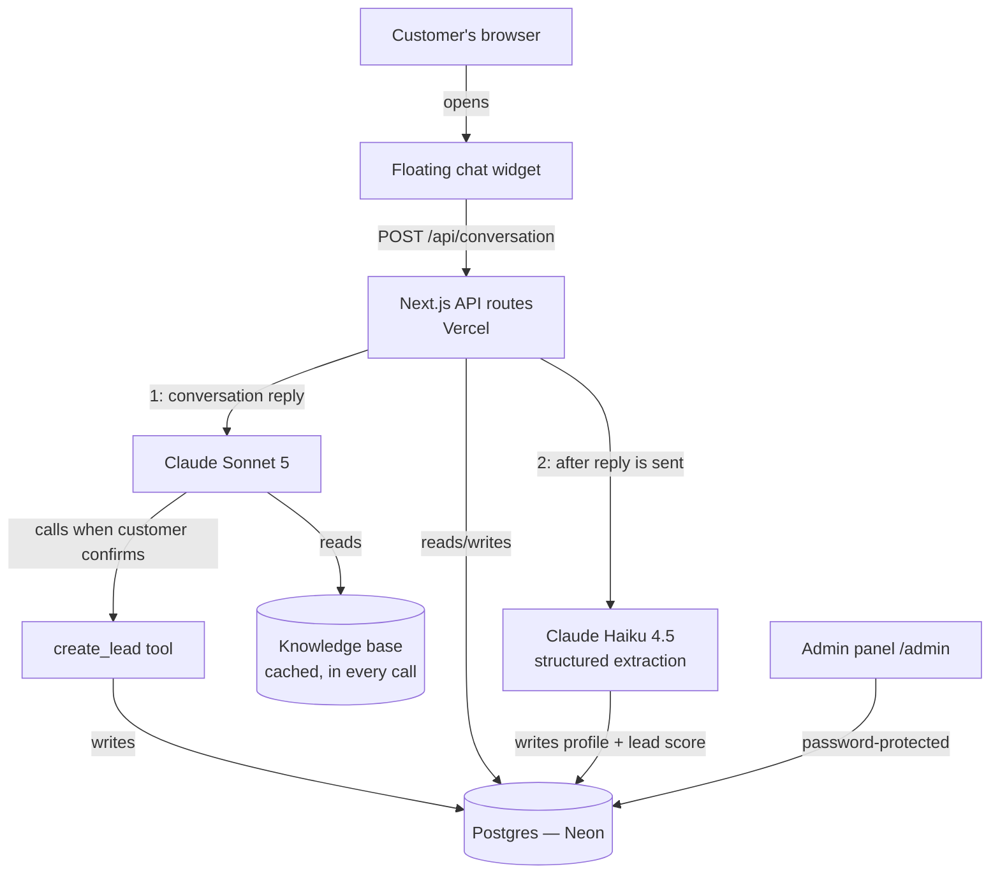

# PayAfterVisa AI Sales Advisor — Deliverables

Prototype built to evaluate in-house capability to build an AI-powered
sales/customer advisory system, as an alternative to buying a ready-made
chatbot product.

## 1. Working URL

**https://payaftervisa-sales-advisor.vercel.app**

Admin panel (password-protected): `/admin`

## 2. Git repository

**https://github.com/MishraRaghav303/payaftervisa-sales-advisor** (private)

## 3. Architecture diagram

**Request flow for one message:** browser → API route → look up/create
customer → call Claude Sonnet 5 (with the knowledge base and the
`create_lead` tool available) → save both messages → **return the reply to
the browser immediately** → *then*, in the background, call Claude Haiku
4.5 to extract structured data and update the customer's profile. The
extraction step runs after the reply is sent specifically so it doesn't
add to how long the customer waits.

## 4. Technology stack used

| Piece | Choice | Why |
|---|---|---|
| App framework | Next.js 16 (TypeScript, App Router) | One deployable app for the homepage, chat API, and admin panel — no separate frontend/backend to wire together or deploy separately |
| Hosting | Vercel | Deploys directly from the CLI/GitHub, free tier is enough for a prototype, zero server management |
| Database | Postgres, hosted on Neon | Relational data (customers → conversations → profiles → leads) fits a relational model naturally; Neon's serverless driver needs no connection-pool management from the app |
| ORM | Drizzle | Typed schema and queries, lightweight, no heavy abstraction over SQL |
| AI | Anthropic Claude API (see §5) | |
| Styling | Tailwind CSS | Fast to build a real visual identity without a design system dependency |

## 5. AI/model used and why

- **Claude Sonnet 5** — handles the actual customer-facing conversation.
  Chosen over Opus-tier for cost (a customer-facing chat product needs to
  handle volume affordably) and over Haiku because the conversation task
  needs to hold context, follow nuanced instructions ("never guarantee visa
  approval," natural information-gathering, deciding when to call the
  lead-creation tool) reliably.
- **Claude Haiku 4.5** — handles structured data extraction from the
  transcript (profile fields + lead scoring) in the background. This is a
  much simpler, well-defined task than conversation, so a cheaper model
  does it just as reliably at roughly a fifth of the per-token cost.
- Both are called through the official Anthropic TypeScript SDK, using
  **prompt caching** (the knowledge base + system instructions are
  identical on every call, so repeat calls reuse the cached version at
  roughly 10% of normal input-token price) and a **lowered reasoning
  effort** setting for the conversation model, since this is a
  straightforward conversational task, not deep multi-step reasoning.

## 6. Database structure

Single Postgres database, six tables:

| Table | Purpose |
|---|---|
| `customers` | One row per visitor (anonymous session token, name/email/phone once known) |
| `messages` | Full conversation transcript |
| `profiles` | Structured extracted data (nationality, destination, budget, timeline, etc.) — one row per customer, updated as the conversation progresses |
| `leads` | Created only when the AI's `create_lead` tool actually runs — status, quality score, recommended action, summary for a human agent |
| `usage_logs` | Every AI API call: model, tokens, estimated cost |
| `knowledge_chunks` | The PayAfterVisa knowledge base content |

Session persistence works via a token stored in the browser's
`localStorage`, not a login — this is what lets someone close the browser
and resume later on the same device, per the original requirement.

## 7. How the knowledge base/RAG works

The knowledge base (currently: UK/Canada/UAE tourist visa products,
pricing, required documents, and business rules) is small enough — under
2,000 tokens — to send **in full, on every call**, rather than doing
similarity-search retrieval over chunks.

This was a deliberate change partway through the build: an earlier version
did per-query retrieval (searching for the most relevant chunks based on
the customer's latest message), but that broke prompt caching, since the
system prompt differed slightly on every turn. Once the AI was instructed
to never answer outside this content — and to say so plainly when it
doesn't know something — the "retrieval" question stopped being about
accuracy and became purely about scale. At the current knowledge base size,
sending everything, once, cached, is both simpler and cheaper than
retrieval would be. If the knowledge base grows significantly (many more
products, countries, or long policy documents), the codebase already has
the database structured to reintroduce chunk-based retrieval.

The AI is explicitly instructed: never invent prices, timelines, or
eligibility rules; never guarantee visa approval; and when a question falls
outside the knowledge base, say it needs verification from the PayAfterVisa
team rather than guessing. This was verified live — e.g. asked about study
visas (not in the current data), the AI correctly declined to answer rather
than inventing information.

## 8. Approximate cost per 100 and 1,000 conversations

Measured directly from real API usage (not estimated), for a representative
4-message conversation that reaches a completed lead:

**$0.033 per full conversation** (4 customer messages, ending in a created
lead record — includes both the Sonnet conversation calls and the Haiku
extraction calls).

Shorter conversations (a visitor asking one or two questions without
completing the full flow) cost less, roughly $0.01–0.02.

| | Estimated cost |
|---|---|
| 100 conversations | **~$2–4** |
| 1,000 conversations | **~$20–40** |

This is API cost only — the Anthropic API is pay-as-you-go with no fixed
monthly fee, so cost scales directly with actual usage. Vercel and Neon
hosting are both within their free tiers at this volume.

## 9. Current limitations

- **Knowledge base only covers 3 tourist visa products** (UK, Canada, UAE)
  — the test data provided didn't include study or work visa information,
  so the AI correctly refuses to answer on those topics. Extending this
  just means adding more knowledge base entries, no architecture change
  needed.
- **No cross-device session resume.** A customer can close and reopen the
  browser on the *same device* and resume their conversation, but not
  switch devices — there's no account/login system for customers (this was
  a deliberate scope decision, see §10).
- **Single shared admin login**, not per-user accounts — fine for a small
  internal team testing a prototype, not for a larger team needing
  individual accounts/audit trails.
- **No rate limiting** on the chat endpoint — a malicious or automated
  actor could send unlimited messages and run up API costs.
- **Cost estimates are directional**, based on real measured conversations
  during testing, not a large production sample.

## 10. What I would change before production deployment

- **Add rate limiting / abuse protection** on the chat API — this is the
  most important pre-production item, since it directly protects against
  runaway API cost.
- **Real per-user admin accounts** instead of one shared password, with
  basic audit logging of who viewed what.
- **Expand the knowledge base** with real study/work visa data (or
  whatever additional services PayAfterVisa actually offers), and revisit
  the "send full knowledge base every time" approach once it's large enough
  that retrieval would clearly pay for itself again.
- **Human handoff mechanism** — right now "human review" is a flag in the
  data; a production version would need this to actually notify a real
  person (Slack/email/CRM integration) rather than requiring someone to
  check the admin panel.
- **Monitoring/alerting** on API cost and error rates, not just historical
  logging.
- **Load testing** — the current latency numbers (a few seconds per
  message) were measured under light testing traffic, not concurrent load.
